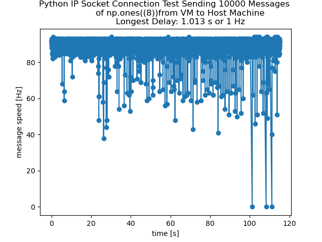
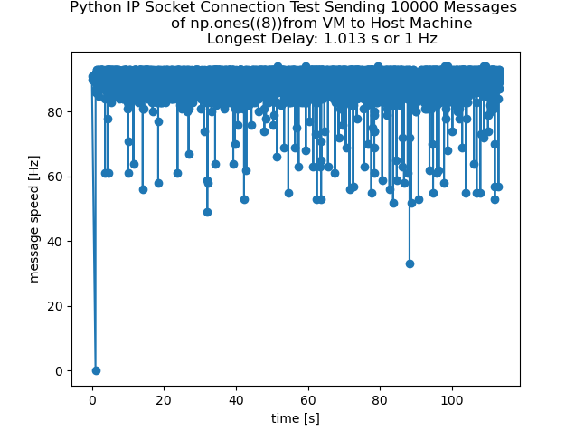
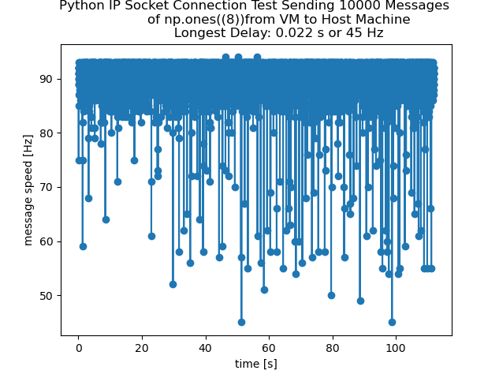
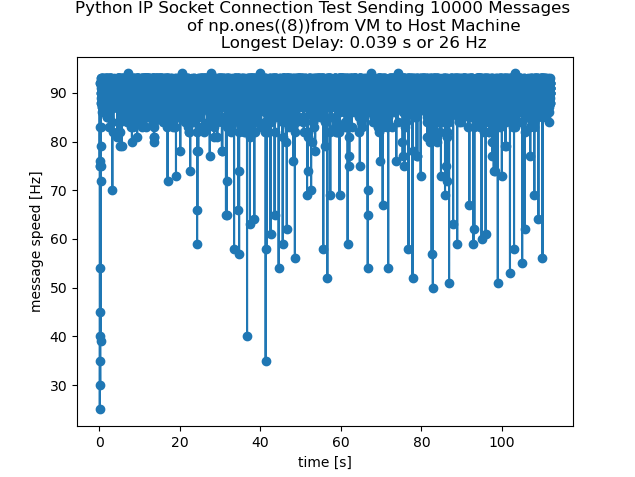
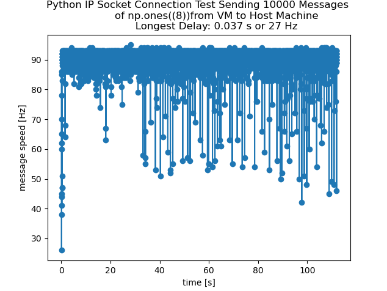
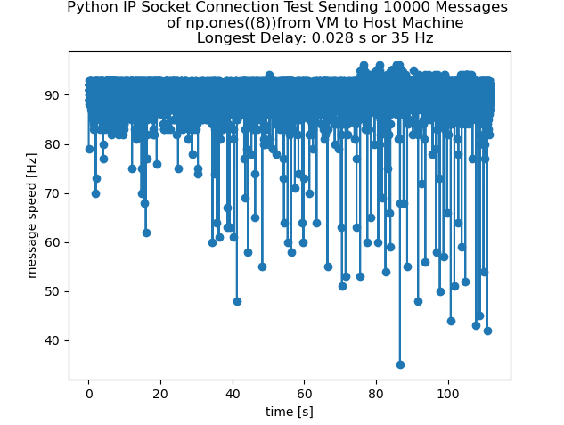
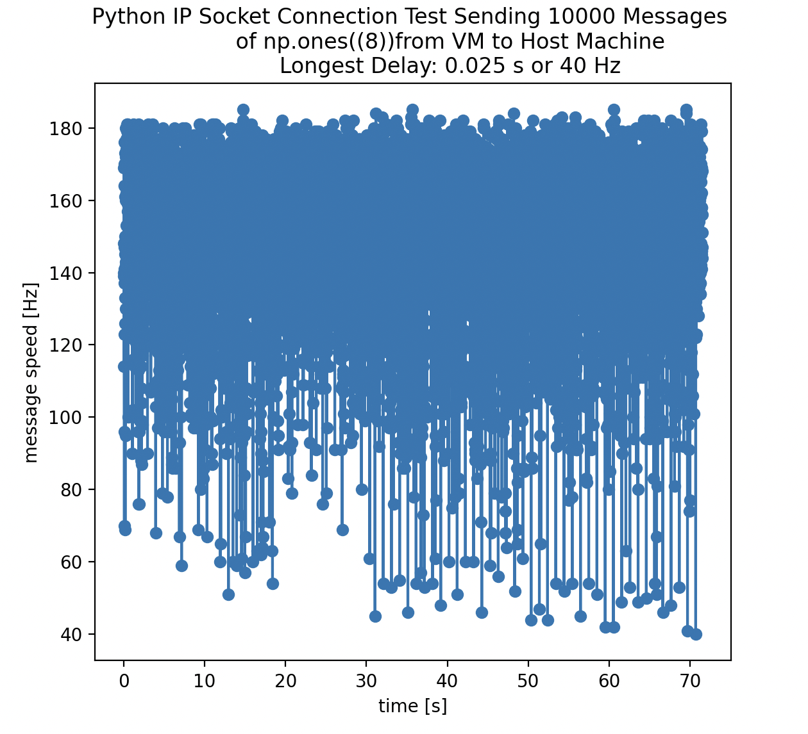
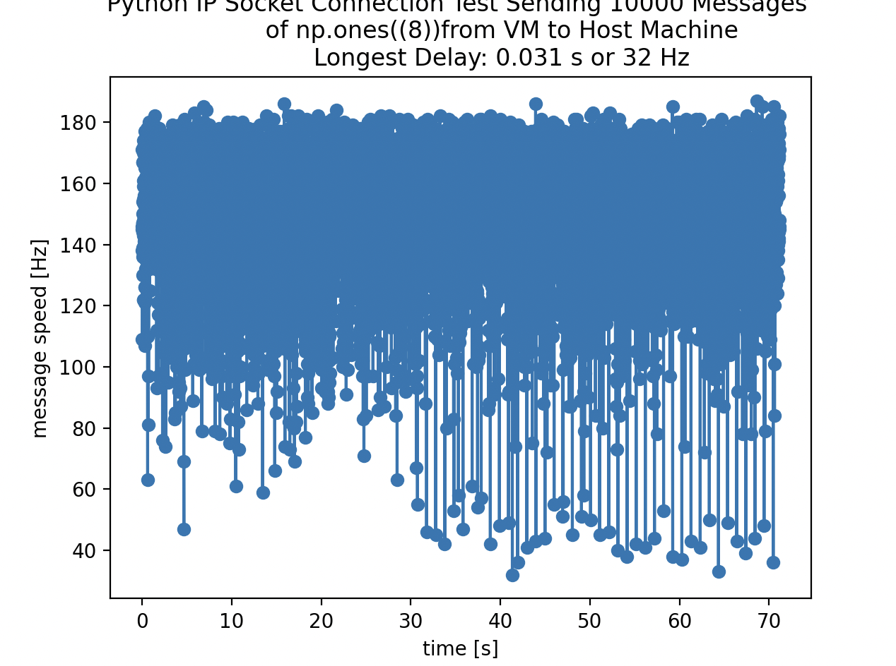

# DataComms

TODO's
* add performance plots (host to host vs guest to host)

# IP Websocket Comms
If you'd like to communicate between machiens using a shared network (e.g. over wifi) you can use Python's "socket" library to get the job done.

## Running IP Websocket Comms
Information can be sent from machine A using ip_client.py to machine B using ip_server.py assuming the following conditions are met:
* both machines are connected to the same network
* the user specifies (a) the IP addresss and (b) port that machine B is reading from as the MACHINE_B_IP_ADDRESS and MACHINE_B_PORT vairables in ip_client.py
* ip_server.py is started first on machine B

## Tinkering Observations

An issue we've observed is that sock.connect is not always consistent in it's connection rate.

This can be an issue if we need a minimum update rate for a long period of time and suggests that an unreliable 

By increasing the client's sock.listen() rate from 1 to 5, we sometimes observe less frequent "drops" in message rates, however as observed in the previous plot, this is not always the case and results are hard to reproduce.

(2/18/24)
Testing Host to Host, we find better drop performance however performance is still inconsistent and was observed to drop below 30Hz (not shown in image).

